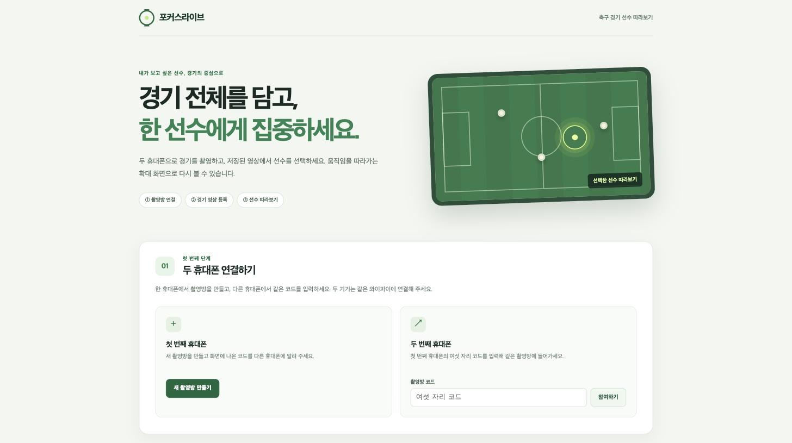
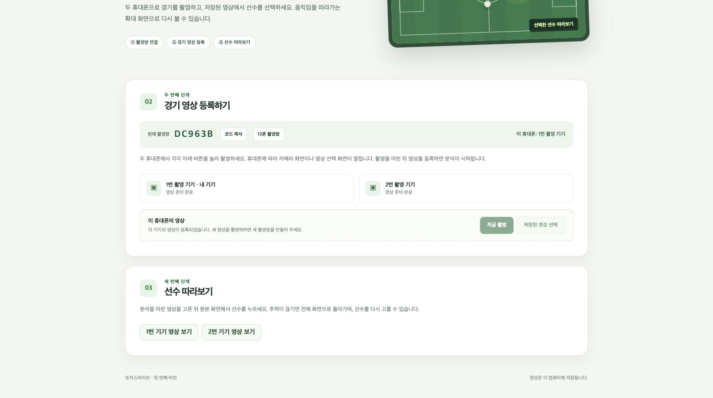
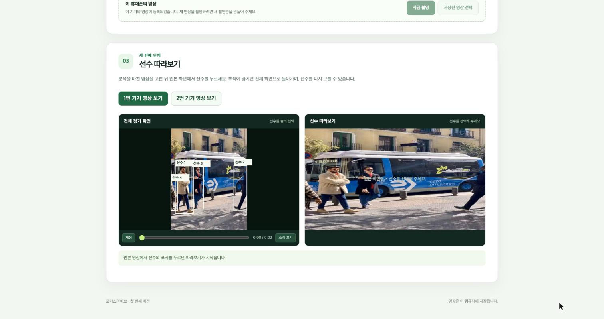
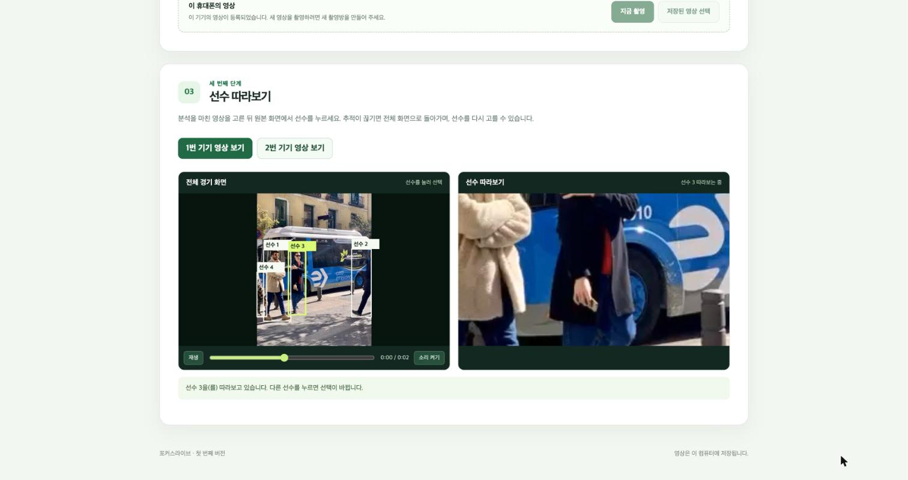

# 포커스라이브

두 휴대폰으로 축구 경기를 촬영하고, 저장된 영상에서 선수를 선택해 확대 화면으로 따라볼 수 있습니다. 촬영방의 한 기기에서 경기를 라이브로 송출하고 다른 브라우저에서 시청할 수도 있습니다. 두 영상의 자동 결합, 라이브 중 선수 추적, 하이라이트 및 활동 통계는 아직 없습니다.

## 화면 미리보기

첫 화면에서 촬영방을 만들거나 코드를 입력해 두 휴대폰을 연결합니다.



연결되면 촬영방 코드와 두 기기의 영상 상태가 표시되고, 각 휴대폰에서 촬영하거나 저장된 영상을 등록합니다.



분석이 끝난 영상을 열면 원본 화면에 선수 후보가 표시됩니다.



선수를 누르면 오른쪽 확대 화면이 그 선수를 따라갑니다.



캡처에 쓴 영상은 동작 확인용 짧은 샘플이라 축구 경기 장면이 아닙니다.

## 준비

- Python 3.10 이상과 `ffmpeg`가 필요합니다. `ffmpeg -version`으로 설치 여부를 확인하세요.
- 두 휴대폰과 서버를 실행할 컴퓨터를 같은 와이파이에 연결하세요.
- 처음 선수 분석을 할 때 추적 모델 파일을 인터넷에서 받습니다. 이후에는 로컬에서 분석합니다.

## 실행

macOS 또는 Linux:

```sh
python3 -m venv .venv
.venv/bin/python -m pip install -r requirements.txt
.venv/bin/python -m uvicorn server:app --host 0.0.0.0 --port 8000
```

Windows PowerShell:

```powershell
py -3 -m venv .venv
.venv\Scripts\python -m pip install -r requirements.txt
.venv\Scripts\python -m uvicorn server:app --host 0.0.0.0 --port 8000
```

컴퓨터에서는 `http://localhost:8000`을 열고, 휴대폰에서는 컴퓨터의 와이파이 주소로 접속하세요. 예를 들어 컴퓨터 주소가 `192.168.0.10`이면 두 휴대폰에서 `http://192.168.0.10:8000`을 엽니다. 방화벽이 접속을 막으면 로컬 네트워크 접근을 허용해야 합니다. 휴대폰 브라우저에서 **라이브 송출**을 하려면 아래 HTTPS 설정이 필요합니다.

## 라이브 송출과 시청

1. 촬영방을 만들거나 참여한 기기에서 **라이브 시작**을 누르고 카메라·마이크 권한을 허용합니다. 한 촬영방에서는 한 기기만 송출합니다.
2. 시청자는 첫 화면의 **라이브 방 보기** 또는 `/live`를 열고 방송 중인 라이브 방을 누릅니다. 목록에는 촬영방 코드 대신 임시 라이브 식별자가 표시됩니다. 시청은 촬영방의 두 기기 자리를 차지하지 않습니다.
3. 송출 기기에서 **라이브 종료**를 누르면 시청 화면도 종료됩니다. 현재 라이브 영상은 저장·분석되지 않으며, 저장과 선수 따라보기는 기존 영상 등록 흐름을 사용합니다.

같은 와이파이의 브라우저끼리 WebRTC로 영상을 직접 주고받습니다. 시청자가 많으면 송출 기기의 업로드 부하가 시청자 수만큼 늘어납니다. 서버는 WebRTC 연결 정보만 전달하므로 **Uvicorn을 한 프로세스(`--workers` 미사용)로 실행**하세요. 다른 네트워크에서 시청하거나 대규모 시청을 하려면 별도의 중계 서버가 필요합니다.

휴대폰에서 카메라를 켜려면 신뢰할 수 있는 HTTPS 주소가 필요합니다. 로컬 개발에서는 [mkcert](https://github.com/FiloSottile/mkcert)를 설치한 뒤, 아래 예시의 IP를 서버 컴퓨터의 와이파이 주소로 바꿔 실행하세요.

```sh
mkdir -p certs
mkcert -install
mkcert -cert-file certs/local.pem -key-file certs/local-key.pem 192.168.0.10 localhost 127.0.0.1
.venv/bin/python -m uvicorn server:app --host 0.0.0.0 --port 8000 --ssl-certfile certs/local.pem --ssl-keyfile certs/local-key.pem
```

휴대폰에도 `mkcert -CAROOT`에 있는 `rootCA.pem`을 설치하고 신뢰 설정을 켠 다음 `https://192.168.0.10:8000`에 접속해야 합니다. `rootCA-key.pem`은 휴대폰에 복사하거나 공유하지 마세요. 인증서와 키는 `certs/`에 두며 Git에 포함하지 않습니다. PC의 OBS 장면을 송출하고 싶다면 [OBS 가상 카메라](https://obsproject.com/kb/virtual-camera-guide)를 켜서 PC 브라우저의 카메라 입력으로 선택할 수 있습니다. OBS의 RTMP 송출을 직접 받는 기능은 없습니다.

## 사용 방법

1. 첫 번째 휴대폰에서 촬영방을 만들고 여섯 자리 코드를 확인합니다.
2. 두 번째 휴대폰에서 촬영방 코드를 입력합니다. 두 번째 휴대폰에 표시된 여섯 자리 확인번호를 첫 번째 휴대폰에서 입력하고 **기기 연결 승인**을 누릅니다. 두 휴대폰의 연결 상태가 화면에 표시됩니다. 확인번호는 5분 동안 유효하며, 예상한 휴대폰의 화면에 표시된 번호인지 직접 확인하세요.
3. 각 휴대폰에서 **촬영 또는 영상 선택**을 누릅니다. 모바일 브라우저가 지원하면 기본 카메라로 촬영할 수 있고, 지원하지 않으면 휴대폰 카메라 앱으로 촬영한 영상을 선택하세요. 두 기기의 촬영 시작과 종료는 각자 조작합니다.
4. 업로드와 분석이 끝나면 원하는 기기의 영상을 열고 원본 화면에서 선수 표시를 누릅니다. 선택한 선수의 움직임을 확대 화면이 따라갑니다. 추적이 끊기면 전체 화면으로 돌아가고 다시 선택할 수 있습니다.

한 기기당 MP4, MOV, M4V 또는 WEBM 영상 하나를 최대 500MB까지 등록할 수 있습니다. 새 촬영을 하려면 **다른 촬영방**을 눌러 새 방을 만드세요. 분석은 약 4프레임/초로 수행하므로 긴 영상은 CPU에서 오래 걸릴 수 있습니다. 일반 사람 검출을 사용하므로 심판이나 관중도 후보로 표시될 수 있고, 가림 또는 화면 전환 시 같은 선수의 추적 번호가 유지되지 않을 수 있습니다.

촬영 영상과 분석 결과는 서버 컴퓨터의 `data/`에 남습니다. 촬영방 코드를 아는 같은 네트워크의 사용자는 영상을 볼 수 있으므로 신뢰할 수 있는 네트워크에서 사용하세요. 외부 공개나 상용 배포 전에 접근 제어와 [Ultralytics 사용 조건](https://www.ultralytics.com/license)을 검토해야 합니다.
